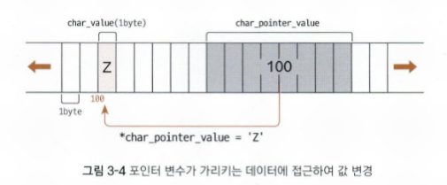

# 3-1. 포인터와 메모리

<aside>

C++의 핵심 기능인 포인터와 메모리 구조를 다룹니다. 데이터가 메모리에 저장되는 방식부터 시작하여, 포인터의 선언과 역참조, 배열과의 관계, 그리고 효율적인 메모리 관리를 위한 동적 메모리 할당(new/delete)의 개념과 주의사항을 학습하는 것이 목적입니다.

</aside>

# 📂 변수와 메모리 주소

프로그램 내의 모든 데이터는 메모리의 특정 공간에 저장되며, 각 공간은 고유한 시작 메모리 주소(Physical/Virtual Address)를 가집니다.

- 자료형별 크기(64bit 기준)
    - `char` : 1 byte
    - `int` : 4 byte
    - `double` : 8 byte
- 메모리 접근
    - CPU는 주소를 통해 메모리에 접근하지만, 프로그래머는 편의를 위해 `변수 이름`을 사용합니다.

---

# 📂 포인터와 연산자

포인터(Pointer)는 일반적인 값이 아닌, 다른 변수의 메모리 주소를 저장하는 변수입니다.

- 선언
    - `자료형 *포인터 변수 이름;`
    
    ```cpp
    #include <iostream>
    
    int main()
    {
        double double_value = 123.456;
    
        double *double_pointer_value = &double_value;
    
        return 0;
    }
    ```
    
- 주소 연산자(&)
    - 변수 앞에 붙여 해당 변수의 주소 값을 알아냅니다.
- 포인터의 크기
    - 시스템 아키텍처에 따라 결정되며(64bit는 8byte), 
    가르키는 데이터의 자료형과 무관하게 일정합니다.
    - 그럼에도 포인터 변수를 선언할 때 데이터 형식을 지정하는 이유는 
    해당 포인터가 가르키는 데이터 형식을 명시하기 위해서 입니다.

<aside>

### 🤔 포인터 크기는 왜 일정할까?

포인터는 ‘주소 전용 수첩’이라고 생각하면 쉽습니다. 

일반 변수가 ‘사과(값)’를 담는 상자라면, 포인터 변수는 ‘사과 상자가 있는 위치’를 
적어놓은 메모지입니다. 

64비트 컴퓨터라면 주소를 적는 종이의 크기는 항상 8 byte로 똑같습니다. 

어떤 집의 주소를 적든 종이 크기가 변하지 않는 것과 같습니다.

</aside>

## 🔎 역참조 연산자 (*)

포인터 변수에 저장된 주소를 따라가서 그곳에 있는 실제 데이터에 접근하는 것을 역참조(Dereferencing)라고 합니다.



- 사용법
    - `*포인터_변수`
- 특징
    - 역참조를 통해 값을 읽을 수도 있고, 해당 주소의 값을 직접 수정할 수도 있습니다.
- 예제 코드
    
    ```cpp
    #include <iostream>
    using namespace std;
    
    int main()
    {
        char char_value = 'A';
        int int_value = 123;
        double double_value = 123.456;
    
        char *char_pointer_value = &char_value;
        int *int_pointer_value = &int_value;
        double *double_pointer_value = &double_value;
    
        // 일반 변수의 데이터 출력
        cout << "char_value: " << char_value << endl;
        cout << "int_value: " << int_value << endl;
        cout << "double_value: " << double_value << endl;
        cout << endl;
    
        // 역참조 연산자로 포인터 변수가 가리키는 데이터 출력
        cout << "*char_pointer_value: " << *char_pointer_value << endl;
        cout << "*int_pointer_value: " << *int_pointer_value << endl;
        cout << "*double_pointer_value: " << *double_pointer_value << endl;
        cout << endl;
    
        // 역참조 연산자로 원본 데이터 덮어쓰기
        *char_pointer_value = 'Z';
        *int_pointer_value = 321;
        *double_pointer_value = 654.321;
    
        // 일반 변수의 데이터 출력(업데이트 확인)
        cout << "char_value: " << char_value << endl;
        cout << "int_value: " << int_value << endl;
        cout << "double_value: " << double_value << endl;
    
        return 0;
    }
    ```
    

---

# 📂 다중 포인터

포인터 역시 메모리에 저장되는 변수이므로 주소를 가집니다. 따라서 포인터의 주소를 저장하는 ‘포인터를 가르키는 포인터’를 만들 수 있습니다.

```cpp
#include <iostream>

int main()
{
    int int_value = 123;

    int *int_pt_value = &int_value;
    int **int_pt_pt_value = &int_pt_value;
    int ***int_pt_pt_pt_value = &int_pt_pt_value;

    return 0;
}
```


- 역참조 횟수
    - 이중 포인터는 `**` 을 사용해 실제 값에 접근하며, 
    n중 포인터는 n번 역참조해야 원본 데이터에 도달합니다.

---

# 📂 배열과 포인터

배열의 이름은 배열의 첫 번째 원소의 시작 주소와 같습니다.

- `&array[i] == array + i`
- 포인터 연산
    - 포인터에 1을 더하면 단순히 주소 숫자가 1 증가하는 것이 아니라, 가리키는 자료형의 크기만큼 주소가 이동합니다. (예시: int는 4 byte씩 이동)
- 주의
    - `sizeof(배열명)` 은 배열 전체 크기를 반환하지만, `sizeof(포인터)` 는 주소값 자체의 크기(8 byte)만 반환하므로 둘은 엄밀히 다릅니다.

---

# 📂 동적 메모리 할당(Dynamic Memory Allocation)

프로그램 실행 중에 필요한 만큼의 메모리를 요청하고 해제하는 방식입니다.

## 🔎 new와 delete

- 할당
    - `new` 연산자를 사용하여 힙(Heap) 영역에 메모리를 할당합니다.
- 해제
    - `delete` 연산자를 사용하여 사용이 끝난 메모리를 반드시 반납해야 합니다.
    - 해제되지 않는 메모리로 인해 **메모리 누수**가 발생합니다.

```cpp
int *val = new int;
delete val;

int *arr = new int[size]; // 할당
delete[] arr;             // 해제 (반드시 [] 사용)
```

## 🔎 메모리 영역 비교

| 구분 | 스택 (Stack) | 힙 (Heap) |
| --- | --- | --- |
| **관리** | 자동으로 할당 및 소멸 | 프로그래머가 직접 관리 (`new/delete`) |
| **특징** | 크기가 제한적임 | 대용량 할당 가능 |
| **위험** | 초과 시 스택 오버플로 발생 | 해제 안 할 시 **메모리 누수(Memory Leak)** 발생 |

<aside>

### 정적 배열과 동적 배열

- 정적 배열
    - 크기가 컴파일 타임에 결정되며, 함수 호출 시 스택(Stack) 영역에 메모리가 할당됩니다.
- 동적 배열
    - 프로그램이 실행 중인 런타임에 필요한 크기만큼 힙(Heap) 영역에 메모리가 할당됩니다.

🚨  단, static 키워드가 붙은 정적 변수는 데이터(Data) 영역에 저장되어 프로그램 시작부터 종료까지 값을 유지합니다.

</aside>

---

# 📂 포인터 사용 시 주의사항

포인터를 안전하게 사용하려면 다음을 주의해야 합니다.

- 유효성 확인
    - 초기화되지 않은 포인터를 역참조하면 프로그램이 강제 종료(Segmentation Fault)될 수 있습니다.
- 범위 준수
    - 할당된 배열의 인덱스를 벗어나는 연산을 피해야 합니다.
- Dangling Pointer
    - 이미 `delete` 로 해제된 메모리 주소를 다시 역참조하면 안됩니다.