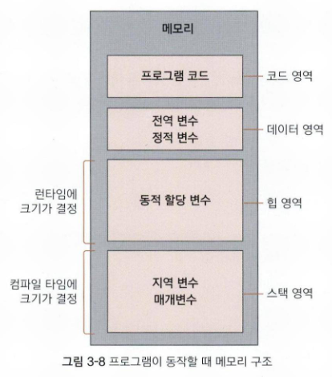

# 3-3. 정적 변수와 상수 변수

# 📂 정적 변수(Static)

## 🔎 정적 변수의 정의와 특징

지역 변수에 `static` 키워드를 사용하면 변수의 유효 범위는 블록 내로 유지되지만, 변수의 수명은 정적 지속성(static duration)으로 바뀝니다.

- 지속성
    - 함수가 종료되어도 메모리에서 사라지지 않고 값을 유지합니다.
- 초기화
    - 함수가 처음 호출될 때 딱 한번만 초기화되며, 프로그램 종료 시까지 유지됩니다. 초기화하지 않으면 컴파일러가 자동으로 0으로 초기화합니다.
- 주요 용도
    - 함수 호출 횟수 카운팅, 객체 간 공유 데이터 생성, 아이디, 생성기 등

## 🔎 메모리 구조와 수명 주기

변수의 수명이 다른 이유는 메모리 상에 저장되는 위치가 다르기 때문입니다.

| 변수 종류 | 메모리 영역 | 할당 및 해제 시점 |
| --- | --- | --- |
| **지역 변수** | 스택(Stack) | 함수 호출 시 할당, 종료 시 해제 |
| **정적 변수** | 데이터(Data) | 프로그램 시작 시 할당, 종료 시 해제 |

# 📂 상수 변수 (const)

## 🔎 일반 변수의 상수화

`const` 키워드를 자료형 앞이나 뒤에 붙이면 해당 변수는 값을 변경할 수 없는 **상수**가 됩니다.
가독성을 위해 `const int a = 1` 과 같이 자료형 앞에 붙이는 것이 권장됩니다.

- 제약 선언 시 반드시 초기화해야 하며, 이후 값을 대입하려고 하면 컴파일 오류(L-Value 오류)가 발생합니다.
- 코드 유지 보수 시, `const` 키워드를 통해 `변경 불가능함` 을 명시하여 개발자의 의도를 전달할 수 있는 역할도 있습니다

## 🔎 포인터 변수의 상수화

포인터와 `const` 를 함께 사용할 때는 키워드의 위치에 따라 상수화 대상이 달라지므로 주의해야 합니다.

- 가르키는 값을 상수화(`const int *ptr`)
    - 포인터를 통해 값을 수정하는 것이 불가능합니다.
- 포인터 자체를 상수화(`int *const ptr`)
    - 포인터가 저장하고 있는 주소 값을 바꿀 수 없습니다. 즉, 한 번 가르킨 대상을 바꿀 수 없습니다.

| 코드 형식 | 상수화 대상 | 의미 |
| --- | --- | --- |
| `const int *ptr` | `*ptr` (값) | 그 주소에 있는 값은 건드리지 마! |
| `int *const ptr` | `ptr` (주소) | 다른 곳(주소) 쳐다보지 말고 여기만 봐! |