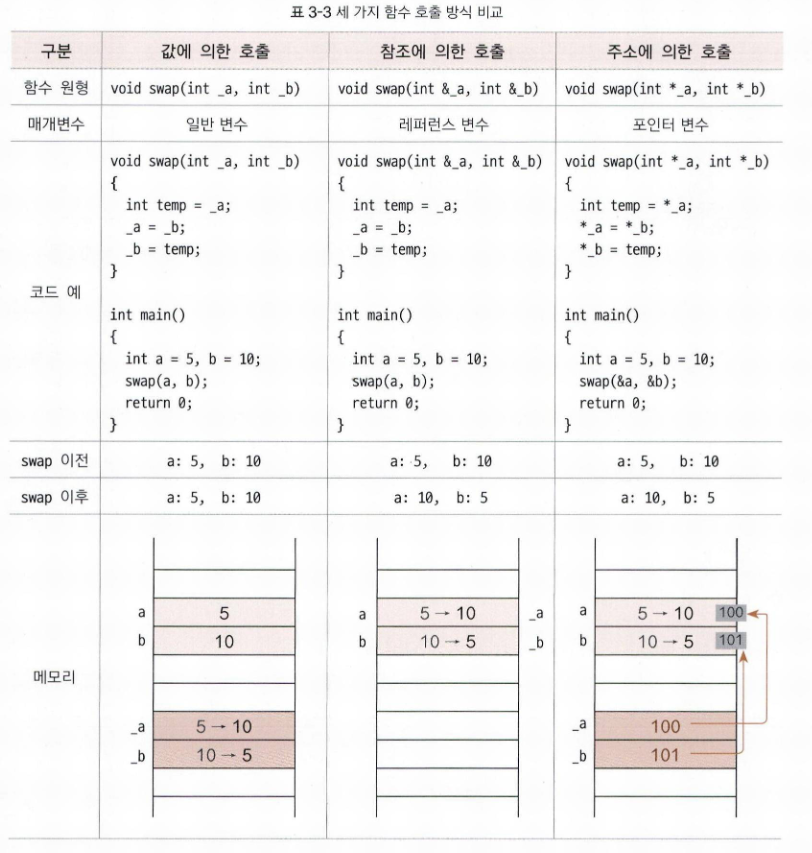

# 3-4. 레퍼런스 변수

<aside>

- 레퍼런스 변수(Reference Variable)의 개념과 특징, 그리고 이를 활용한 참조에 의한 호출(Call by Reference) 방식을 설명합니다.
- 특히 일반 변수, 포인터 변수와의 차이점을 비교하고, 레퍼런스를 사용할 때 주의해야 할 문법적 제약 사항을 다룸으로써 안전하고 효율적인 프로그래밍 방법을 제시하는 것이 목적입니다.
</aside>

# 📂 레퍼런스 사용하기

## 🔎 레퍼런스(Reference)란?

레퍼런스는 기존에 존재하는 변수에 대한 별칭(Alias) 또는 또 다른 이름을 부여하는 것 입니다.
새로운 메모리 공간을 할당받아 값을 복사하는 것이 아니라, 이미 존재하는 변수의 메모리 공간을 공유합니다.

## 🔎 선언 방법

자료형 뒤에 앰퍼샌드(`&`)기호를 사용하여 선언합니다.

```cpp
int value = 10;
int &ref_value = value; // value 변수의 별명으로 ref_value 선언
```

# 📂 세 가지 함수 호출 방식



## 1️⃣ 값에 의한 호출(Call by Value)

- 인자로 넘어온 값을 매개변수에 복사
- 함수 내부에서 매개변수 값을 바꿔도 호출한 곳의 원본 변수에는 영향이 없습니다

## 2️⃣ 참조에 의한 호출(Call by Reference)

- 매개변수를 레퍼런스 변수로 선언
- 함수 내부에서 매개변수를 조작하면 호출한 곳의 원본 변수 값이 직접 변경됨
- 복사 과정이 없으므로 성능상 이점이 있음

## 3️⃣ 주소에 의한 호출(Call by Address)

- 매개변수를 포인터 변수로 선언하고, 인자로 변수의 주소(&a)를 넘깁니다
- 역참조 연산자(`*` )를 사용하여 원본 값에 접근합니다

| 구분 | 값에 의한 호출 | 참조에 의한 호출 | 주소에 의한 호출 |
| --- | --- | --- | --- |
| **매개변수 형태** | `int a` | `int &a` | `int *a` |
| **전달 방식** | `swap(a, b)` | `swap(a, b)` | `swap(&a, &b)` |
| **원본 변경 여부** | 변경 안 됨 | **변경됨** | **변경됨** |

# 📂 레퍼런스 사용 시 주의사항

레퍼런스는 편리하지만 포인터보다 제약 사항이 많습니다.

- 반드시 선언과 동시에 초기화해야 함
    - 누구의 별명인지 바로 정해줘야합니다. 독립적으로 존재할 수 없습니다.
    - `int &ref;` (X) → `int &ref = value;` (O)
- 참조 대상 변경 불가(재지정 불가)
    - 한 번 별명이 된 레퍼런스는 나중에 별명이 변경될 수 없습니다
    - `ref = value2;` 라고 쓰면 참조 대상이 바뀌는 게 아니라, 
    기존 참조 대상의 값이 `value2`의 값으로 덮어 씌워집니다.

# 📂 포인터 vs 레퍼런스

| 특징 | 포인터 (Pointer) | 레퍼런스 (Reference) |
| --- | --- | --- |
| **정의** | 메모리 주소를 저장하는 변수 | 변수의 또 다른 이름(별칭) |
| **안전성** | 잘못된 주소 접근 위험이 있음 | 상대적으로 안전함 |
| **유연성** | 대상 변경 가능, NULL 가능 | 대상 변경 불가, 반드시 초기화 필요 |
- 포인터는 주소를 직접 다루는 ‘마스터 키’ 같습니다. 강력하지만 잘못 쓰면 집 전체(메모리)를 망가뜨릴 수 있습니다.
- 레퍼런스는 그 키를 안전하게 포장해서 만든 ‘특정 방문 전용 손잡이’ 같습니다. 포인터보다 쓰기 쉽고 실수할 확률이 적어서 C++에서는 레퍼런스 사용을 권장하는 경우가 많습니다.