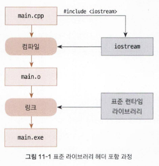

# 11-1 표준 라이브러리 구성과 사용법

# 표준 라이브러리 구성

C++ 표준 라이브러리는 언어의 핵심 부분으로, 100여 개가 넘는 헤더 파일로 구성되어 있으며 지속적으로 업데이트됩니다.

- **입출력**: 파일, 키보드, 화면과의 상호 작용을 위한 입출력 스트림을 지원합니다.
- **문자열 처리**: 문자열 조작, 검색, 대소문자 변환 등의 기능을 제공합니다.
- **컨테이너**: `vector`, `list`, `queue`, `stack` 등의 자료 구조를 제공하여 데이터를 저장하고 관리합니다.
- **알고리즘**: 검색, 정렬, 변환, 그래프 알고리즘 등을 제공하여 코드 작성 및 최적화를 돕습니다.
- **기타 유틸리티**: 작업을 단순화하고 생산성을 높이는 다양한 도구와 유틸리티 함수를 제공합니다.
모든 기능을 외울 필요는 없으며, IDE 도움말이나 참고 사이트를 활용할 수 있습니다.

<aside>

## 서드 파티 라이브러리

C++ 표준 라이브러리 외에도 개인이나 조직이 개발한 많은 라이브러리를 **서드 파티 라이브러리**라고 합니다.

- **예시**:
    - **OpenCV(Open Computer Vision)**: 영상 처리 및 컴퓨터 비전 작업(얼굴 감지, 객체 추적, 이미지 필터링 등)에 사용됩니다.
    - **TensorFlow**: 머신러닝 및 딥러닝 알고리즘 개발 및 구현에 사용됩니다.
    서드 파티 라이브러리는 해당 라이브러리 공식 웹 사이트나 오픈소스 저장소(예: [boost.org](http://boost.org/))에서 얻을 수 있으며, 내려받은 후 헤더를 포함하고 명세에 따라 기능을 사용하면 됩니다.
</aside>

# 표준 라이브러리 사용 방법

C++ 표준 라이브러리를 사용하려면 `#include <파일_이름>` 형식으로 헤더 파일을 지정해야 합니다.

- `#include` 구문은 전처리기에 헤더 파일을 현재 소스에 포함하도록 알리는 역할을 합니다.
- 표준 라이브러리 헤더를 포함할 때는 `<>`(화살괄호)를 사용합니다. 이는 컴파일러와 함께 제공되는 헤더 파일을 포함할 때 사용합니다. (현재 소스 파일이 있는 디렉토리에서 헤더 파일을 찾을 때는 `""`(큰따옴표)를 사용합니다.)

**예시**:

```cpp
#include <iostream> // iostream 헤더 파일 포함
using namespace std;

int main() {
    cout << "Hello World!\\n"; // 표준 출력 사용
    return 0;
}
```

- 위 코드의 첫 줄 `#include <iostream>`은 `iostream` 헤더 파일의 모든 내용을 복사해 오도록 전처리기에 요청하며, 이를 통해 `std::cout`과 같은 `iostream`에 정의된 기능을 사용할 수 있게 됩니다.
- 일반적으로 헤더 파일에는 함수와 변수가 선언만 되어 있고, 실제 내용은 **링크 단계**에서 자동으로 연결되는 **표준 런타임 라이브러리**에 구현되어 있습니다. 예를 들어, `std::cout`은 `iostream` 헤더에 선언되어 있지만, 링크 단계에서 연결되는 표준 런타임 라이브러리에 정의되어 있습니다.

